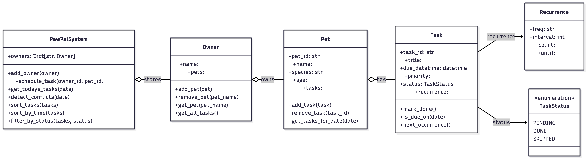
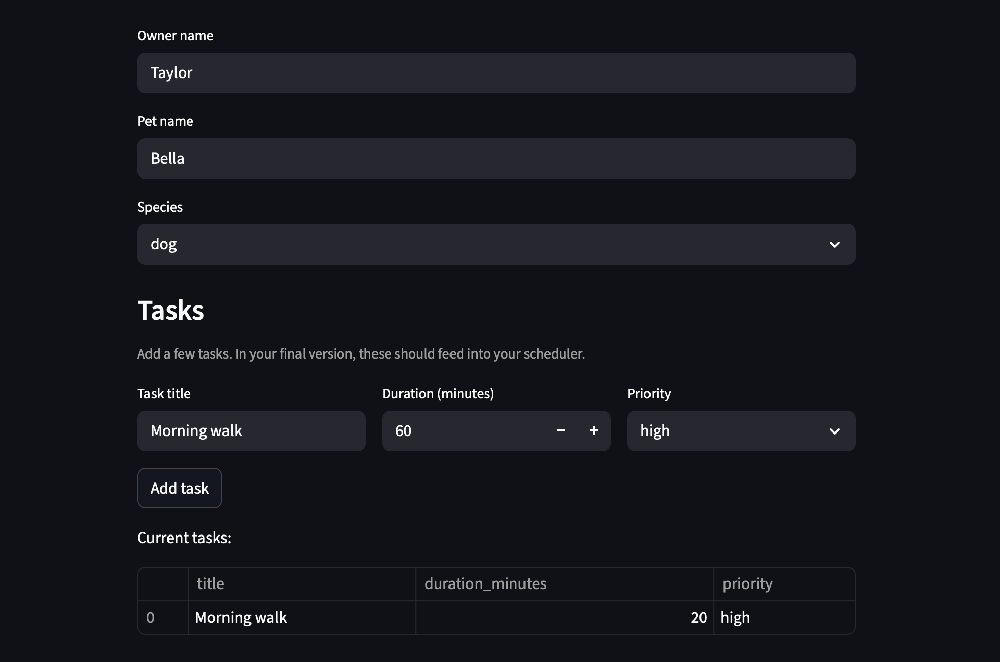

# PawPal+ (Module 2 Project)

You are building **PawPal+**, a Streamlit app that helps a pet owner plan care tasks for their pet.

## Scenario

A busy pet owner needs help staying consistent with pet care. They want an assistant that can:

- Track pet care tasks (walks, feeding, meds, enrichment, grooming, etc.)
- Consider constraints (time available, priority, owner preferences)
- Produce a daily plan and explain why it chose that plan

Your job is to design the system first (UML), then implement the logic in Python, then connect it to the Streamlit UI.

## What you will build

Your final app should:

- Let a user enter basic owner + pet info
- Let a user add/edit tasks (duration + priority at minimum)
- Generate a daily schedule/plan based on constraints and priorities
- Display the plan clearly (and ideally explain the reasoning)
- Include tests for the most important scheduling behaviors

## Features

- Task sorting by due time with priority tiebreaks so urgent items surface first.
- Conflict detection that emits warnings when tasks share the exact same due datetime.
- Support for simple recurring tasks (daily and weekly); completing a recurring task auto-creates the next occurrence.
- CLI demo available via `main.py` and a Streamlit UI visualization in `app.py` for interactive use.

## System Architecture



## Demo

Below is a screenshot of the Streamlit UI showing the generated schedule and conflict warnings.



## Getting started

### Setup

```bash
python -m venv .venv
source .venv/bin/activate  # Windows: .venv\Scripts\activate
pip install -r requirements.txt
```

### Suggested workflow

1. Read the scenario carefully and identify requirements and edge cases.
2. Draft a UML diagram (classes, attributes, methods, relationships).
3. Convert UML into Python class stubs (no logic yet).
4. Implement scheduling logic in small increments.
5. Add tests to verify key behaviors.
6. Connect your logic to the Streamlit UI in `app.py`.
7. Refine UML so it matches what you actually built.

## Smarter Scheduling

- Sorts tasks by due time (earlier tasks shown first) and tiebreaks by priority so urgent items surface.
- Supports filtering tasks by completion status or by pet to focus the CLI view.
- When you mark a recurring task done (daily or weekly), the system auto-creates the next occurrence so routines continue without manual re-entry.
- Emits lightweight conflict warnings when multiple tasks share the exact same due datetime so you can resolve collisions quickly.

Smarter Scheduling
Sorts tasks by due time so daily plans print in order.
Filters tasks by status (pending vs done).
Detects scheduling conflicts when two tasks share the same time.
Supports simple recurring tasks (daily or weekly) by creating the next occurrence when completed.
Then save.
If they also want Testing section, add:

Testing PawPal+
Run: python -m pytest
Covers: sorting correctness, recurrence next occurrence, conflict detection, pets with no tasks.
Confidence level: ⭐⭐⭐⭐ (4/5)